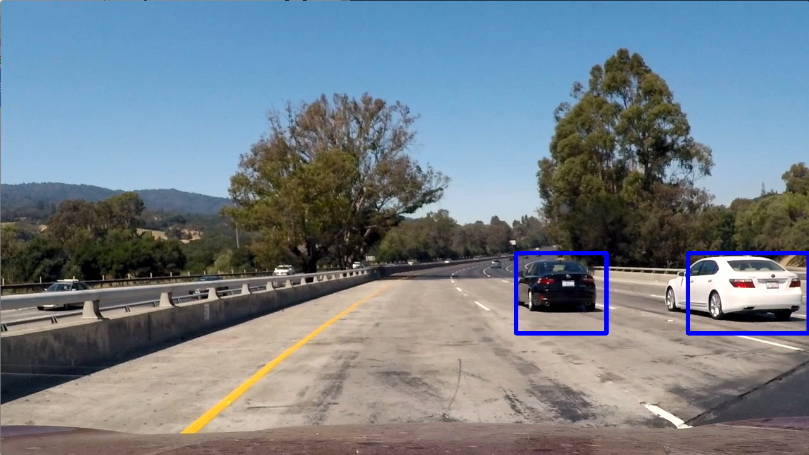

# Vehicle Detection

### Overview

The goal of this project was to write a software pipeline to detect vehicles in a video stream. 

It uses a combination of color histograms, spatial binning, and histograms of gradients (HOG) subsampling to extract features from each image. A linear Support Vector Machine was then trained on the data and used to make predictions on sections of each frame.

To extract these sections, HOG subsampling was first performed on the entire frame, then the image was scaled and broken up into cells. Scaling the image allows each cell to encompass more or less of the image depending on the scale factor. Each cell is taken and the features are extracted using the methods mentioned above, and a prediction is made. This prediction has a threshold applied based on its confidence in the prediction, which helps eliminate false positives.

After that, the frame is converted to a heatmap based on the predictions made, and boxes are drawn around areas that are considered "hot". A threshold is applied at this step as well to further prevent false positives.

Check out [my writeup](writeup.md) to learn more about my process and how it works.

### Dependencies

This project requires:

- [CarND Term1 Start Kit](https://github.com/udacity/CarND-Term1-Starter-Kit)

### Data

I used three sets of data for training my project, although the first one with a few augmentations was all that was necessary to achieve the desired result.

- [Udacity Autti/crowdai labeled dataset](https://github.com/udacity/self-driving-car/tree/master/annotations)
- [GTI/KITTI vehicle dataset](https://s3.amazonaws.com/udacity-sdc/Vehicle_Tracking/vehicles.zip)
- [GTI/KITTY non-vehicle dataset](https://s3.amazonaws.com/udacity-sdc/Vehicle_Tracking/non-vehicles.zip)

I also performed [hard negative mining](https://www.reddit.com/r/computervision/comments/2ggc5l/what_is_hard_negative_mining_and_how_is_it/) on the [project video](project_video.mp4) to help eliminate false positives in places where the pipeline struggled.

