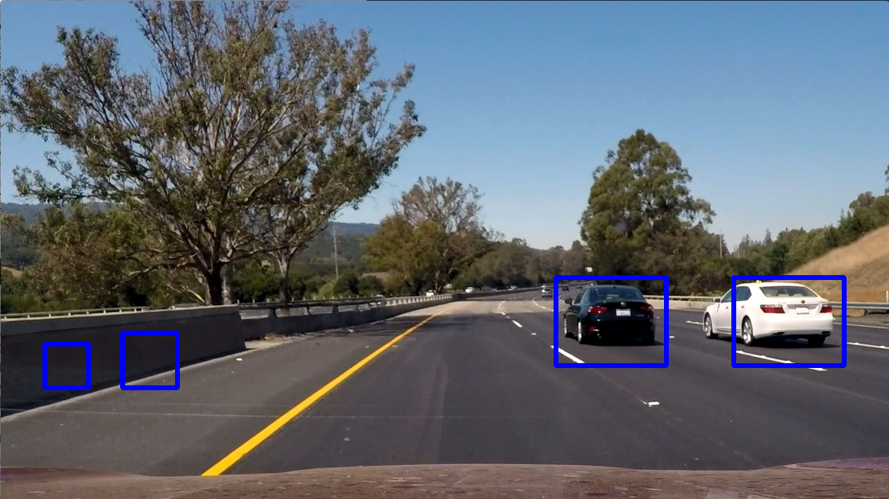
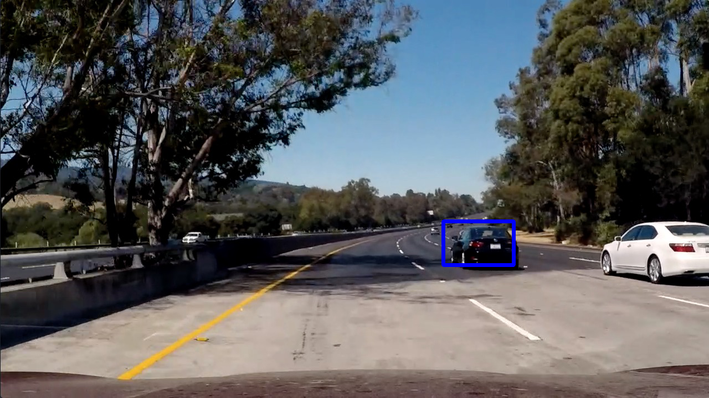
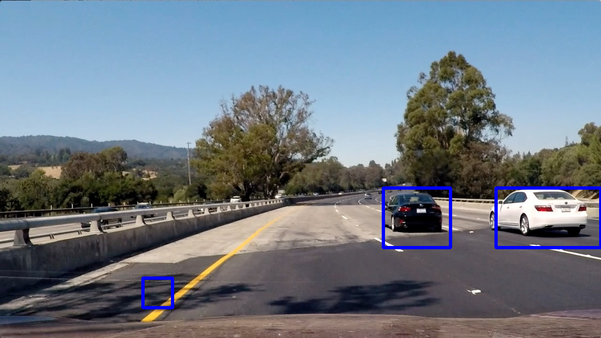
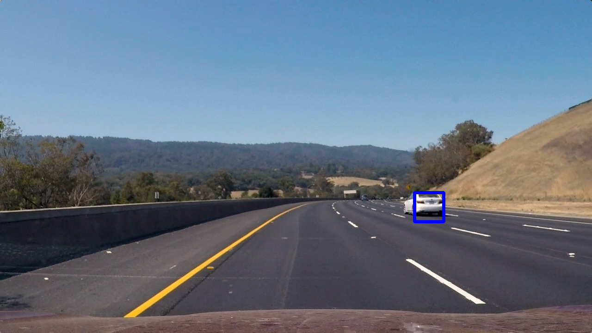
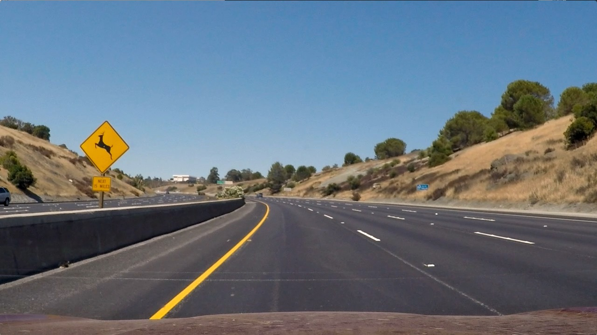

## Writeup Template
### You can use this file as a template for your writeup if you want to submit it as a markdown file, but feel free to use some other method and submit a pdf if you prefer.

---

**Vehicle Detection Project**

The goals / steps of this project are the following:

* Perform a Histogram of Oriented Gradients (HOG) feature extraction on a labeled training set of images and train a classifier Linear SVM classifier
* Optionally, you can also apply a color transform and append binned color features, as well as histograms of color, to your HOG feature vector.
* Note: for those first two steps don't forget to normalize your features and randomize a selection for training and testing.
* Implement a sliding-window technique and use your trained classifier to search for vehicles in images.
* Run your pipeline on a video stream (start with the test_video.mp4 and later implement on full project_video.mp4) and create a heat map of recurring detections frame by frame to reject outliers and follow detected vehicles.
* Estimate a bounding box for vehicles detected.

## [Rubric](https://review.udacity.com/#!/rubrics/513/view) Points
### Here I will consider the rubric points individually and describe how I addressed each point in my implementation.  

---
### Writeup / README

#### 1. Provide a Writeup / README that includes all the rubric points and how you addressed each one.  You can submit your writeup as markdown or pdf.  [Here](https://github.com/udacity/CarND-Vehicle-Detection/blob/master/writeup_template.md) is a template writeup for this project you can use as a guide and a starting point.  

You're reading it!

### Histogram of Oriented Gradients (HOG)

#### 1. Explain how (and identify where in your code) you extracted HOG features from the training images.

The code for this step is contained in the function `getHogFeatures()` (cell 4 in `vehicle_detection.ipynb`).

I started by getting all of the vehicle and non-vehicle image paths in the Udacity dataset. I then called the `extractFeatures()` function (cell 4 `vehicle_detection.ipynb`)  which loaded each image one at a time and extracted features, including HOG features, from the images. Here is an example of one of each of the `vehicle` and `non-vehicle` classes:

I explored different color spaces and different `skimage.hog()` parameters (`orientations`, `pixels_per_cell`, and `cells_per_block`).  I grabbed random images from each of the two classes and displayed them to get a feel for what the `skimage.hog()` output looks like.

Here is an example using the `YCrCb` color space and HOG parameters of `orientations=8`, `pixels_per_cell=(8, 8)` and `cells_per_block=(2, 2)`:

#### 2. Explain how you settled on your final choice of HOG parameters.

I tried various combinations of parameters starting with the ones used in the lessons. The combination I settled on do a good job of extracting enough features from each image without causing a large increase in the amount of time it took to process each image.

#### 3. Describe how (and identify where in your code) you trained a classifier using your selected HOG features (and color features if you used them).

I trained a linear SVM using roughly 17,500 data points and a standard scaler. This happens in the `Classifier` class (cell 5 in `vehicle_detection.ipynb`).

### Sliding Window Search

#### 1. Describe how (and identify where in your code) you implemented a sliding window search.  How did you decide what scales to search and how much to overlap windows?

I tested both the sliding window method and the HOG subsampling method (cells 21-30 in `test_pipeline.ipynb`) and settled on HOG subsampling using the `findCars()` function that was used during the lessons (cell 6 in `vehicle_detection.ipynb`). I decided on the scale based on experimentation. I went with a scales of 1.0, 2.0, and 3.0  because they to classify both cars close to the camera and ones on the horizon, and did not increase the processing time, which was an issue with lower scales.

#### 2. Show some examples of test images to demonstrate how your pipeline is working.  What did you do to optimize the performance of your classifier?

The main technique I used to optimize my filter was using the classifier's `decision_function()` (cell 4 and 6 in `vehicle_detection.ipynb`) to filter out predictions that are below a certain confidence threshold. This means the pipeline identifies a car where it is confident there is one.

---

### Video Implementation

#### 1. Provide a link to your final video output.  Your pipeline should perform reasonably well on the entire project video (somewhat wobbly or unstable bounding boxes are ok as long as you are identifying the vehicles most of the time with minimal false positives.)

Here's a [link to my video result](./output_images/output_video.mp4)

#### 2. Describe how (and identify where in your code) you implemented some kind of filter for false positives and some method for combining overlapping bounding boxes.

From the positive detections I created a heat map and then applied a threshold to that heatmap to identify vehicle positions.  I then used `scipy.ndimage.measurements.label()` to identify individual blobs in the heat map, and assumed each blob corresponded to a vehicle.  I drew bounding boxes to cover the area of each blob detected.  

Here's an example result showing the heat map from a series of frames of video, the result of `scipy.ndimage.measurements.label()` and the bounding boxes then overlaid on the last frame of video:

### Here are six frames and their corresponding heatmaps:

### Here the resulting bounding boxes are drawn onto the last frame in the series:

---

### Discussion

#### 1. Briefly discuss any problems / issues you faced in your implementation of this project.  Where will your pipeline likely fail?  What could you do to make it more robust?

I struggled with this project for a month a finally I took a step back and rebuilt it while following along with the Q&A video Ryan did. This, coupled with the fact that I began using Jupyter notebooks to test my code instead of standar Python files, helped me fix mistakes that were causing problems and identify what parts of my pipeline needed to be improved. Once I finally broke everything down into individual components and tested them, I was able to make a lot of progress really quickly

However, my pipeline still has occasional false positives, most likely because the road changes and sharper edges cause it to think there is a car there. I performed hard negative mining on the video in spots where there were a lot more false positives and this seemed to improve the results greatly. Taking the time to go through and correctly extract good negative images from the video, as well as training on more data, would probably go a long way in fixing these problems.