## Writeup Template
### You can use this file as a template for your writeup if you want to submit it as a markdown file, but feel free to use some other method and submit a pdf if you prefer.

---

**Vehicle Detection Project**

The goals / steps of this project are the following:

* Perform a Histogram of Oriented Gradients (HOG) feature extraction on a labeled training set of images and train a classifier Linear SVM classifier
* Optionally, you can also apply a color transform and append binned color features, as well as histograms of color, to your HOG feature vector.
* Note: for those first two steps don't forget to normalize your features and randomize a selection for training and testing.
* Implement a sliding-window technique and use your trained classifier to search for vehicles in images.
* Run your pipeline on a video stream (start with the test_video.mp4 and later implement on full project_video.mp4) and create a heat map of recurring detections frame by frame to reject outliers and follow detected vehicles.
* Estimate a bounding box for vehicles detected.

[//]: # (Image References)
[image1]: ./examples/car_not_car.png
[image2]: ./examples/HOG_example.jpg
[image3]: ./examples/sliding_windows.jpg
[image4]: ./examples/sliding_window.jpg
[image5]: ./examples/bboxes_and_heat.png
[image6]: ./examples/labels_map.png
[image7]: ./examples/output_bboxes.png
[video1]: ./project_video.mp4

## [Rubric](https://review.udacity.com/#!/rubrics/513/view) Points
### Here I will consider the rubric points individually and describe how I addressed each point in my implementation.  

---
### Writeup / README

#### 1. Provide a Writeup / README that includes all the rubric points and how you addressed each one.  You can submit your writeup as markdown or pdf.  [Here](https://github.com/udacity/CarND-Vehicle-Detection/blob/master/writeup_template.md) is a template writeup for this project you can use as a guide and a starting point.  

You're reading it!

### Histogram of Oriented Gradients (HOG)

#### 1. Explain how (and identify where in your code) you extracted HOG features from the training images.

The code for this step is contained in the function `getHogFeatures()` (lines 7-24 in `helper_functions.py`).

I started by reading in all the `vehicle` and `non-vehicle` images. This included reading the `labels.csv` files in the Autti and CrowdAI datasets and organizing the data in a pandas DataFrame. I then used to loaded each image, scaled and resized if necessary, and used a generator to pass them to the `extractFeatures()` function (lines 40-75 in `helper_functions.py`). Here is an example of one of each of the `vehicle` and `non-vehicle` classes:

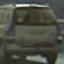
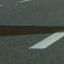

I then explored different color spaces and different `skimage.hog()` parameters (`orientations`, `pixels_per_cell`, and `cells_per_block`).  I grabbed random images from each of the two classes and displayed them to get a feel for what the `skimage.hog()` output looks like.

Here is an example using the `YCrCb` color space and HOG parameters of `orientations=8`, `pixels_per_cell=(8, 8)` and `cells_per_block=(2, 2)`:

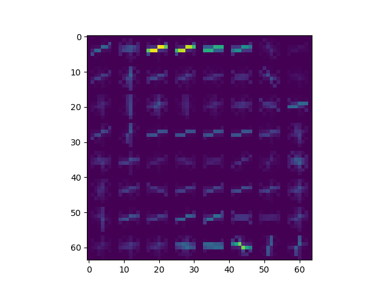

#### 2. Explain how you settled on your final choice of HOG parameters.

I tried various combinations of parameters and I honestly never really found ones that did that well. The combination I settled on seemed to show some promise, but it still never seemed like the classifier really knew what a car was.

#### 3. Describe how (and identify where in your code) you trained a classifier using your selected HOG features (and color features if you used them).

I trained a linear SVM using 15,000+ data points, principle component analysis, and a standard scaler. This happens in the `Model` class in `model.py`. I was able to train it to upwards of 98% accuracy, but it still never seemed to fully know what a car was in an image. While it did sometimes seem to identified the cars occasionally, there are so many false positives that it is impossible to filter them out without also filtering out the true positives.

### Sliding Window Search

#### 1. Describe how (and identify where in your code) you implemented a sliding window search.  How did you decide what scales to search and how much to overlap windows?

I pretty much just used the standard `findCars()` function that was used during the lessons. I decided on the scale based on experimentation. I went with a scales of 1.0, 2.0, and 3.0 because they seemed about as effective as any other scale and did not increase the processing time, which was an issue with lower scales.

#### 2. Show some examples of test images to demonstrate how your pipeline is working.  What did you do to optimize the performance of your classifier?

Honestly, my pipeline doesn't work. I have been playing with training parameters for weeks now, and while it occasionally identifies cars correctly, for the most part there are so many false positives and so few correct identifications that it's impossible to filter out the false positives, and doesn't seem like the classifier is correctly identifying cars. This is especially frustrating because of how well it performs on the validation data. Ultimately I searched on one scale using YCrCb 3-channel HOG features plus spatially binned color and histograms of color in the feature vector, which provided slightly better results than any other combination.  Here is an example image:

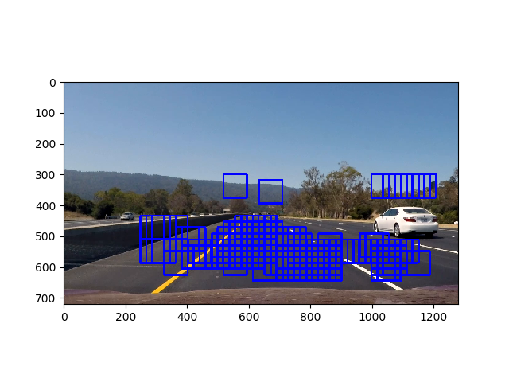
---

### Video Implementation

#### 1. Provide a link to your final video output.  Your pipeline should perform reasonably well on the entire project video (somewhat wobbly or unstable bounding boxes are ok as long as you are identifying the vehicles most of the time with minimal false positives.)
Here's a [link to my video result](./output_video.mp4)

#### 2. Describe how (and identify where in your code) you implemented some kind of filter for false positives and some method for combining overlapping bounding boxes.

The most effective filter is filtering out false predictions in lines 186-188 in `detector.py`, where I get the prediction probability using `decision_function()` and filter out predictions that are below a certain confidence threshold. I also thresholded bounding boxes in the heatmap, although there were so many false positives that it made it difficult not filter them out and not also filter out the correct identifications. I recorded the positions of positive detections in each frame of the video.  From the positive detections I created a heatmap and then thresholded that map to identify vehicle positions.  I then used `scipy.ndimage.measurements.label()` to identify individual blobs in the heatmap.  I then assumed each blob corresponded to a vehicle.  I constructed bounding boxes to cover the area of each blob detected.  

Here's an example result showing the heatmap from a series of frames of video, the result of `scipy.ndimage.measurements.label()` and the bounding boxes then overlaid on the last frame of video:

### Here are six frames and their corresponding heatmaps:

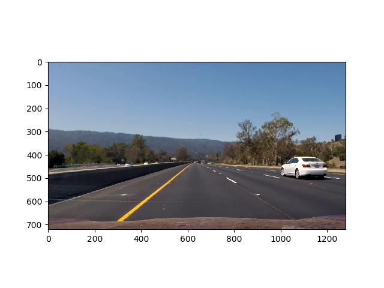

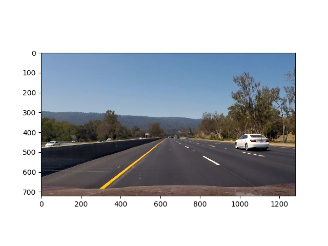
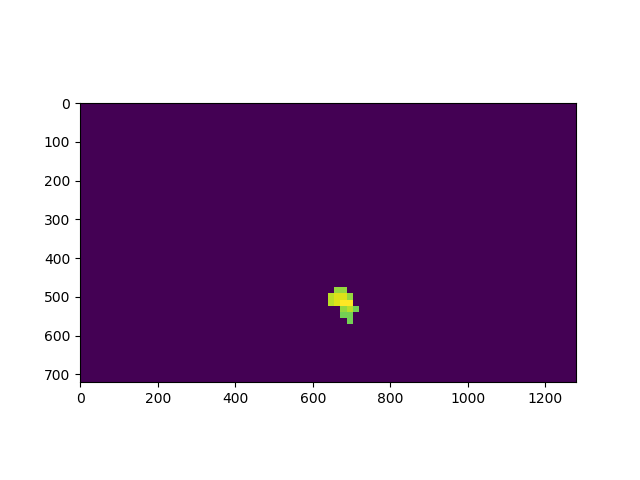
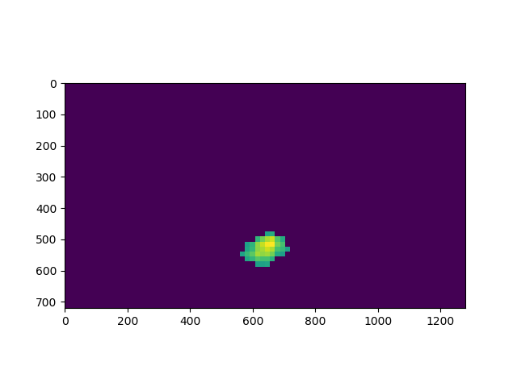
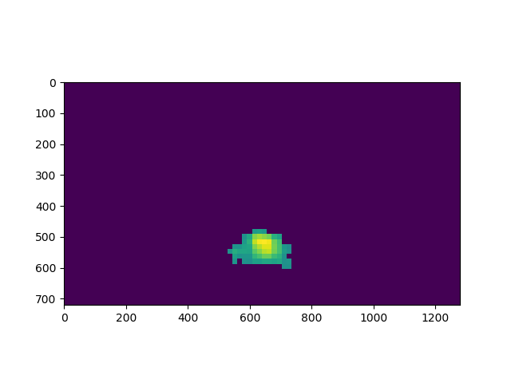
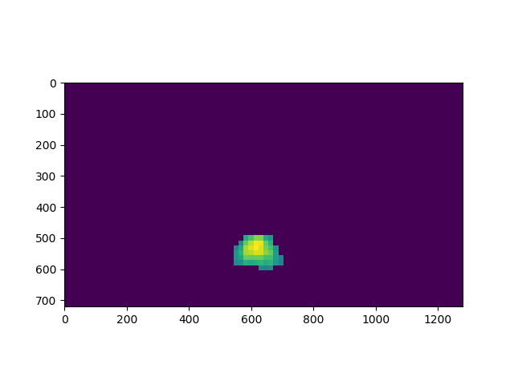
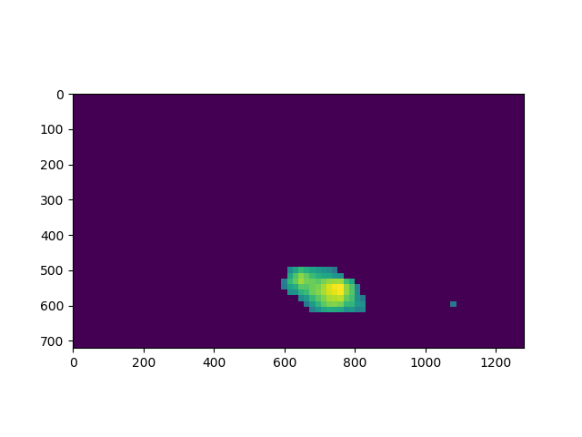
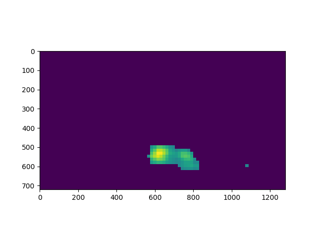

### Here the resulting bounding boxes are drawn onto the last frame in the series:
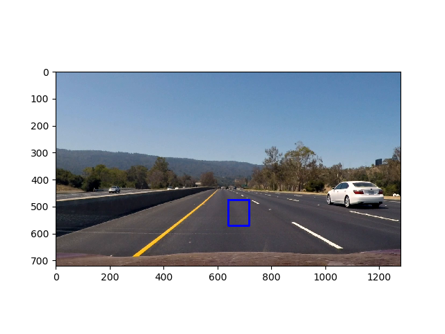
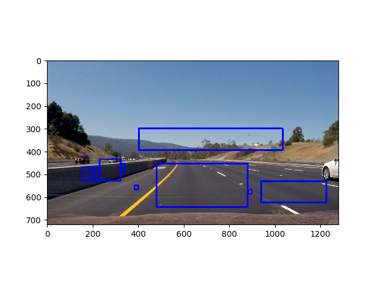

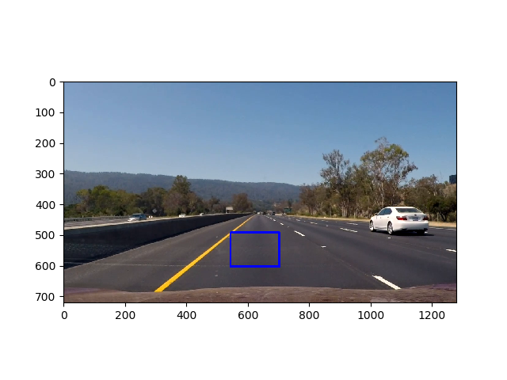

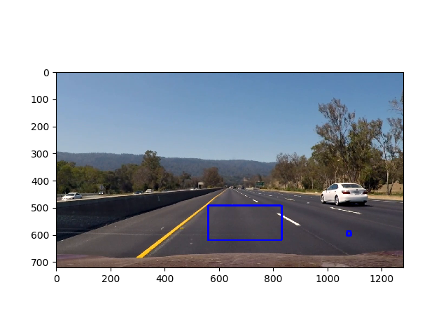

---

### Discussion

#### 1. Briefly discuss any problems / issues you faced in your implementation of this project.  Where will your pipeline likely fail?  What could you do to make it more robust?

##### First submission comments
I'm so stuck on this project. I've been working on it for weeks and I feel like I'm actually pretty close, but that last little bit is really causing huge issues in the pipeline. I have experimented a lot, as well as read posts on the discussion boards, and found what I think is a good set of parameters. I'm using both the Udacity data set, the Autti dataset, and the CrowdAI dataset to train my classifier, and I used 15,000+ images, which was the most I could do on and AWS EC2 instance without running into memory issues. This gets me to my classifier is 98% accurate or more when run on the validation data.

I'm also thresholding both based on the confidence measure of each prediction, and on the heat maps, although thresholding on the heat maps has been difficult because the false positives are about as dense, if not more dense, than the correct identifications, which means that filtering them out also filters out areas that I want to keep.

I am very stuck and could really use some help and feedback. Again, I think I understand what is happening and have played around with it enough to feel like I am close, but for some reason I have reached a point where no matter what I do nothing really improves.

The pipeline is also incredibly slow when processing the video, which is mostly due to `pixels_per_cell` being so low, but I know from reading discussions on the forum that having `pixels_per_cell = 8` is not uncommon, so I'm wondering if there's anything that could be done to speed it up. It seems like everything is necessary so I'm struggling to identify what could be made faster. It took about an hour and a half just to process 10 seconds of video, which is why I did not process the full video (upwards of 8 hours).

##### Second submission comments
This is my second submission, and I'm still having issues. The advice from the reviewer on the first one was to implement multiple sliding window scales, which helped a little bit, but still didn't have a huge effect because the classifier just really isn't identifying the cars at all, despite 98% accuracy.

I would also really like some advice on speeding up the pipeline, because it takes about 20 minutes to process 3 seconds of video, so it will take all day to process the entire video.
